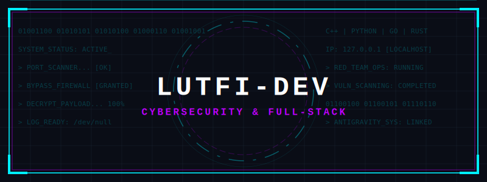

<p align="center">
  
</p>

<p align="center">
  <a href="https://git.io/typing-svg">
    
  </a>
</p>

---

### 👤 About Me
```cyan
[SYSTEM STATUS: ONLINE]
[ROLE: FULL-STACK ENGINEER & CYBERSECURITY ANALYST]
```

* 🚀 **Core Focus**: Developing secure, high-performance, and scalable full-stack applications while building advanced cybersecurity tools for red team operations.
* 🛡️ **Cybersecurity Tools**: Currently engineering vulnerability scanners, web technology fingerprinting tools, and AI-integrated penetration testing frameworks.
* 🤝 **Collaboration**: Looking to collaborate on open-source cybersecurity tools, ethical hacking automation, secure backend systems, and enterprise-grade fullstack platforms with real-time analytics.
* 🌱 **Current Research**: Advanced exploitation techniques, machine learning for cyber threat detection, network protocol fuzzing, and optimization of distributed backend infrastructure.
* ⚡ **Fun Fact**: *I build tools that protect systems — and break them first to understand how they fail. My journey blends curiosity, ethical hacking, and precision coding. (Yes, my cat often supervises my exploits at 3AM).*

---

### 💻 Tech Stack & Specializations

<table width="100%">
  <tr>
    <td width="50%" valign="top">
      <h4>🛡️ Offensive Security & Systems</h4>
      
      
      
      
      
      
      <br>
      <h4>⚙️ Backend & Database Engineering</h4>
      
      
      
      
      
      
      
    </td>
    <td width="50%" valign="top">
      <h4>🎨 Frontend & Mobile Client</h4>
      
      
      
      
      
      
      
      <br>
      <h4>🛠️ Cloud & DevOps Infrastructure</h4>
      
      
      
      
      
      
      
    </td>
  </tr>
</table>

---

### 📊 GitHub Metrics

<p align="center">
  <picture>
    <source media="(prefers-color-scheme: dark)" srcset="https://raw.githubusercontent.com/MuhammadLutfiMuzakiiVY/MuhammadLutfiMuzakiiVY/output/github-contribution-grid-snake-dark.svg">
    <source media="(prefers-color-scheme: light)" srcset="https://raw.githubusercontent.com/MuhammadLutfiMuzakiiVY/MuhammadLutfiMuzakiiVY/output/github-contribution-grid-snake.svg">
    
  </picture>
</p>

<p align="center">
  
  
</p>

<p align="center">
  
  
</p>

---

### 🔗 Connect With Me

<p align="center">
  <a href="mailto:muhammadlutfimuzaki2@gmail.com"></a>
  <a href="https://linkedin.com/in/muhammad-lutfi-muzaki-a55373263"></a>
  <a href="https://bsky.app/profile/lutfisky.bsky.social"></a>
  <a href="https://discord.gg/1094563584777932840"></a>
  <a href="https://behance.net/muhammamuzaki13"></a>
  <a href="https://medium.com/@muhammadlutfimuzaki"></a>
</p>

<p align="center">
  <a href="https://instagram.com/muhammadlutfimuzaki.vy"></a>
  <a href="https://youtube.com/@lutfitalks"></a>
  <a href="https://reddit.com/user/M_Lutfii_Muzaki"></a>
  <a href="https://quora.com/profile/Muhammad-Lutfi-Muzaki"></a>
</p>

<p align="center">
  <a href="https://buymeacoffee.com/Lutfi"></a>
  <a href="https://paypal.me/lutfiskyvy"></a>
</p>

---

<p align="center">
  
</p>
